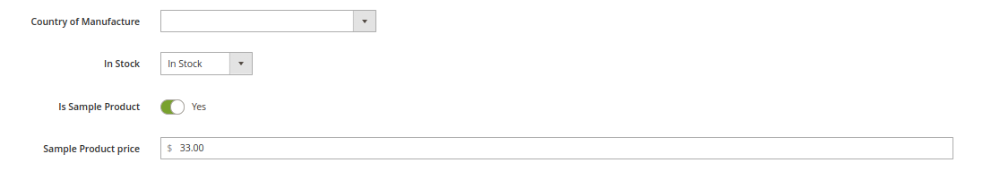
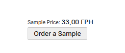
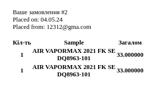
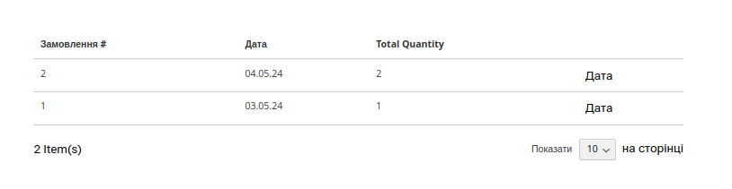
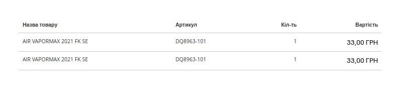
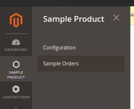
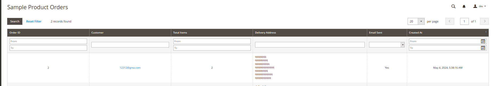
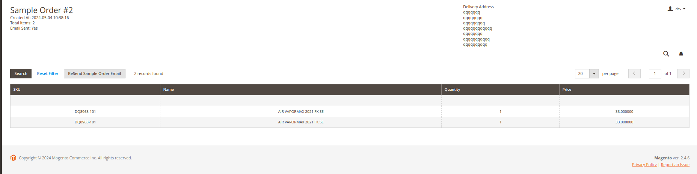

# Product Sampler Module for Magento 2

This Magento 2 module allows your e-shop conduct sale and management of product samples, enabling customers to try your products before making a purchase.

## Key Features:

### Adding Product Samples to Cart

Products can be flagged with a special attribute **is_sample_product** = true to become available as samples for customers. Customers can add a sample to their cart as a separate item.

If a product has all the necessary configurations , a block like this will appear on the product page:

### Notification to Admin on Sample Orders

If a price is specified for a sample, the administrator receives a notification about the sample purchase with the specified price. If no price is specified, the administrator receives a notification without a price to track sample orders.

### Managing Sample Orders in User Account

Users can view all their sample orders in their personal account with details about each order, including status and other information.

### Configuring Product Samples

For each product sample, you can configure:
- The sample price.
- The **is_sample_product** attribute, which determines if the product is available as a sample.
- Maximum quantity of samples in one order.

### Admin Notifications and Order Management

After placing an order, both the customer and administrator receive notifications with details about sample orders. The administrator can view and manage all sample orders through the Magento admin panel.

## Installation and Usage Instructions:

1. Installing the Module:
    - Copy the module files to the app/code directory of your Magento 2 installation.
    - Run the command **php bin/magento setup:upgrade** to install the module.
    - Run the command **php bin/magento setup:static-content:deploy** if necessary to update static resources.

2. Configuring Module Parameters:
    - Navigate to the Magento admin panel.
    - Configure prices and other parameters for each product sample.
    - Set the **is_sample_product** attribute for products that should be available as samples.

3. Using the Module by Customers:
    - Customers can add samples to their cart like any other product.
    - Customers can view their sample orders and their status in their personal account.

4. Admin Order Management:
    - Admins can view all sample orders in the Magento admin panel.
    - Admins receive notifications with details about new sample orders.

## Support

If you have any questions or issues with using the module, please contact the [module author](mailto:doliaanatolii@gmail.com) for additional assistance.
